# Jenkins CI/CD Pipeline for Two-Tier Flask Application

## Project Overview

This project demonstrates how to build a complete CI/CD pipeline using Jenkins for a Dockerized Two-Tier Flask Application.

The pipeline automates the following workflow:

```text
GitHub Repository
        ↓
Jenkins Pipeline
        ↓
Clone Source Code
        ↓
Build Docker Image
        ↓
Push Image to DockerHub
        ↓
Deploy Application using Docker Compose
        ↓
GitHub Webhook Automation
```

The goal of this project was to gain hands-on experience with Jenkins Pipeline creation, Docker integration, DockerHub image publishing, automated deployments, and GitHub Webhooks.

---

# Technologies Used

* Jenkins
* Docker
* Docker Compose
* DockerHub
* GitHub
* GitHub Webhooks
* AWS EC2 (Ubuntu)

---

# CI/CD Pipeline Stages

## Stage 1 - Clone Source Code

Jenkins connects to the GitHub repository and clones the application source code into the Jenkins workspace.

Pipeline Code:

```groovy
stage('Clone Code') {
    steps {
        git branch: 'main',
            url: 'https://github.com/your-repository.git'
    }
}
```

---

## Stage 2 - Build Docker Image

After cloning the code, Jenkins builds a Docker image for the Flask application.

Pipeline Code:

```groovy
stage('Build Docker Image') {
    steps {
        sh 'docker build -t two-tier-flask-app .'
    }
}
```

### Troubleshooting

Initial pipeline execution failed with:

```bash
docker: not found
```

This issue occurred because Docker was not installed on the Jenkins server.

Resolution:

```bash
sudo apt update
sudo apt install docker.io -y
```

A second issue occurred because the Jenkins user did not have permission to access Docker.

Resolution:

```bash
sudo usermod -aG docker jenkins
sudo systemctl restart docker
sudo systemctl restart jenkins
```

---

## Stage 3 - Push Docker Image to DockerHub

DockerHub credentials were securely stored in Jenkins Global Credentials.

Jenkins used those credentials to:

* Login to DockerHub
* Tag the image
* Push the image to DockerHub

Pipeline Code:

```groovy
stage('Push To DockerHub') {
    steps {
        withCredentials([
            usernamePassword(
                credentialsId: 'dockerhub-creds',
                usernameVariable: 'DOCKER_USER',
                passwordVariable: 'DOCKER_PASS'
            )
        ]) {

            sh '''
            echo $DOCKER_PASS | docker login -u $DOCKER_USER --password-stdin

            docker tag two-tier-flask-app:latest $DOCKER_USER/two-tier-flask-app:latest

            docker push $DOCKER_USER/two-tier-flask-app:latest
            '''
        }
    }
}
```

---

## Stage 4 - Deploy Application

The final stage deploys the application using Docker Compose.

Pipeline Code:

```groovy
stage('Deploy Application') {
    steps {
        sh 'docker compose up -d --build'
    }
}
```

This automatically creates and starts all required containers.

---

# GitHub Webhook Integration

To achieve continuous integration, GitHub Webhooks were configured.

Whenever code is pushed to the repository:

1. GitHub sends a webhook event.
2. Jenkins receives the webhook.
3. Jenkins automatically triggers the pipeline.
4. The entire CI/CD process executes without manual intervention.

Webhook URL:

```text
http://<jenkins-server-ip>:8080/github-webhook/
```

---

# Jenkins Pipeline

Final Pipeline Structure:

```text
Clone Code
    ↓
Build Docker Image
    ↓
Push To DockerHub
    ↓
Deploy Application
```

---

# Project Screenshots

## EC2 and Jenkins Setup

### EC2 Server Created

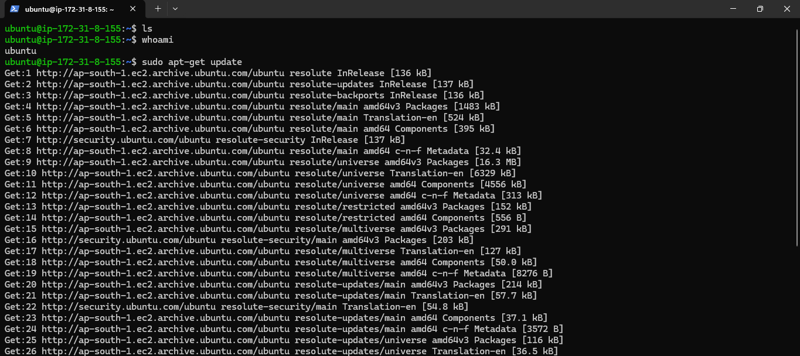

### Java Installed

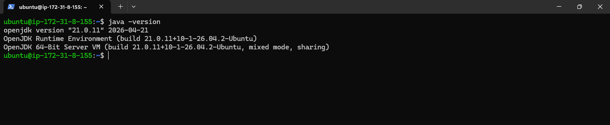

### Jenkins Service Running

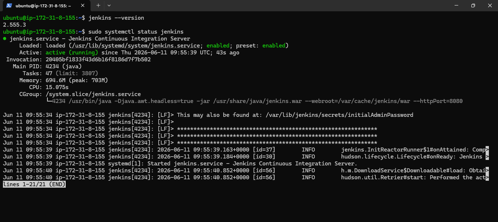

### Jenkins Unlock Screen

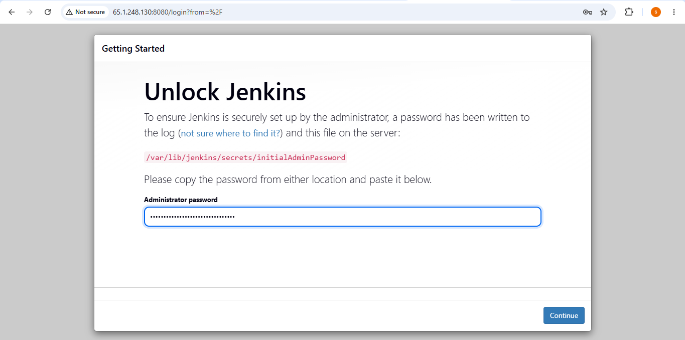

### Jenkins Dashboard

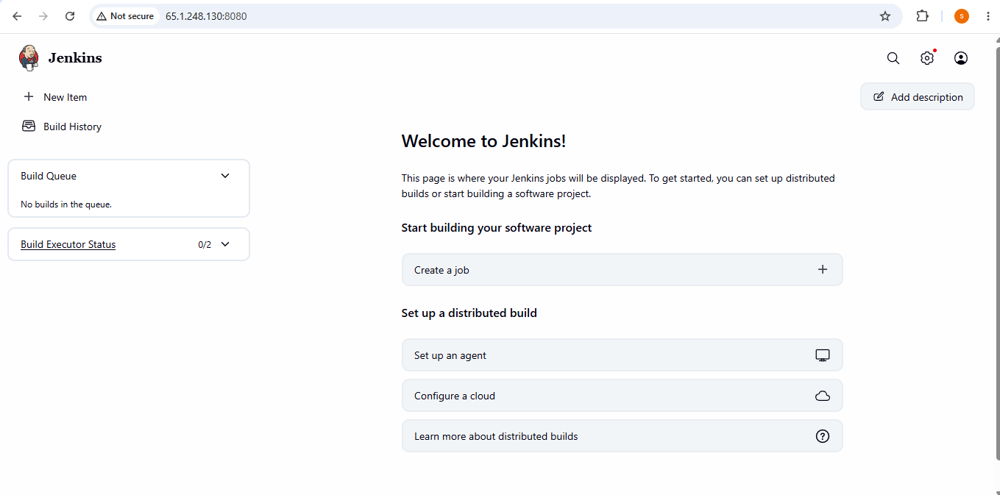

---

## Pipeline Creation

### Pipeline Job Created

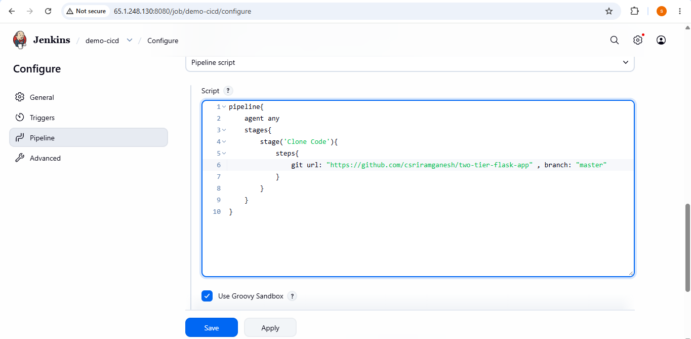

### Clone Stage Success

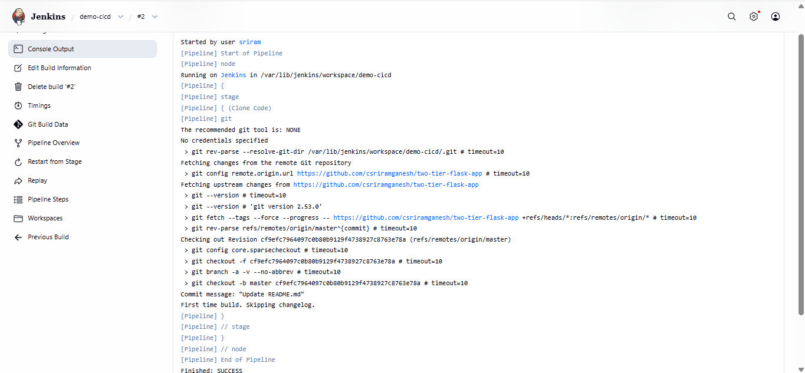

### Workspace Verification

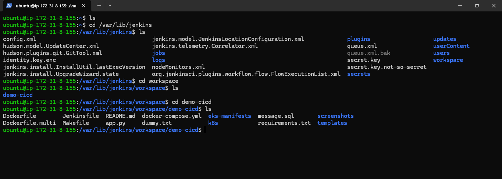

---

## Docker Integration

### Docker Not Found Error

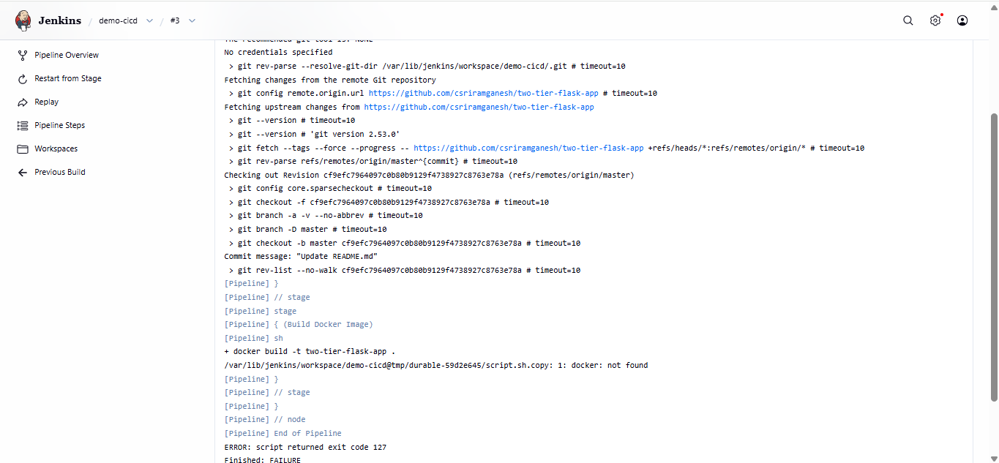

### Docker Service Running

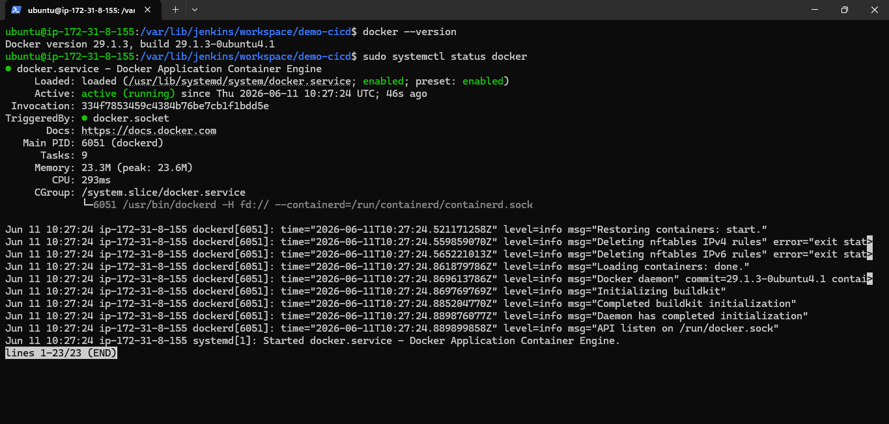

### Jenkins Added to Docker Group

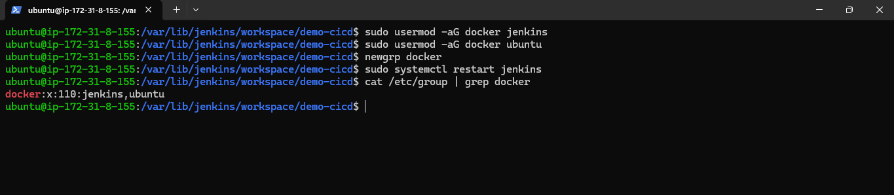

### Docker Build Stage Success

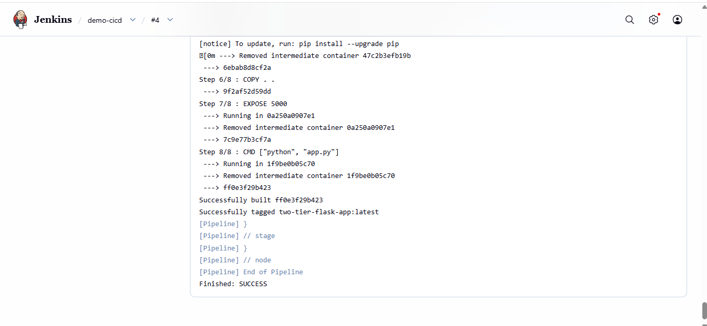

### Docker Image Verified

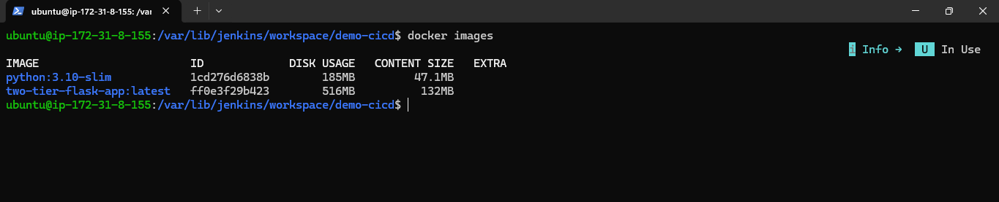

---

## DockerHub Integration

### Jenkins Credentials

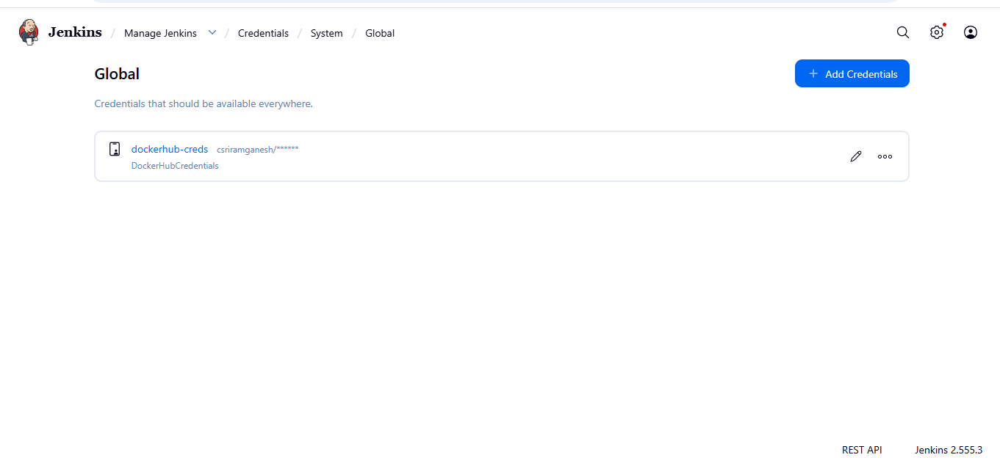

### Push Stage Added

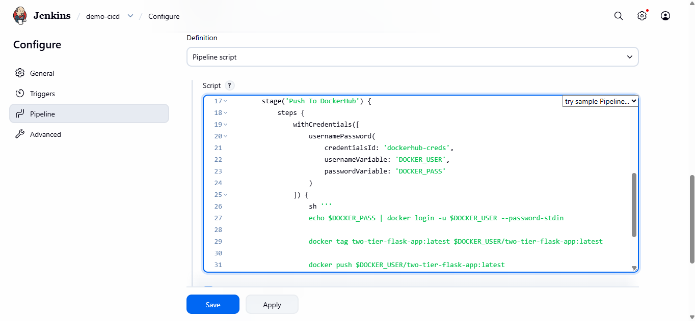

### DockerHub Push Success

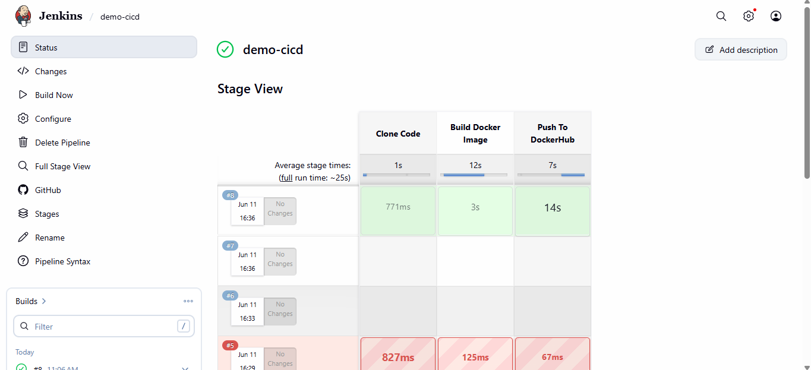

### DockerHub Repository Updated

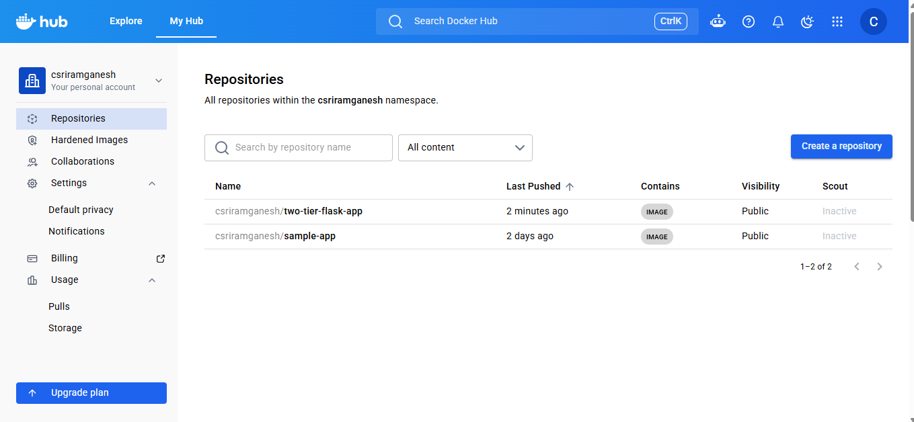

---

## Deployment

### Deploy Stage Added

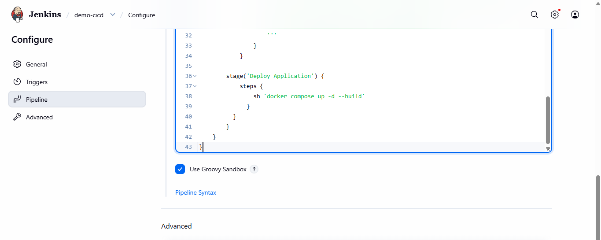

### Deploy Stage Success

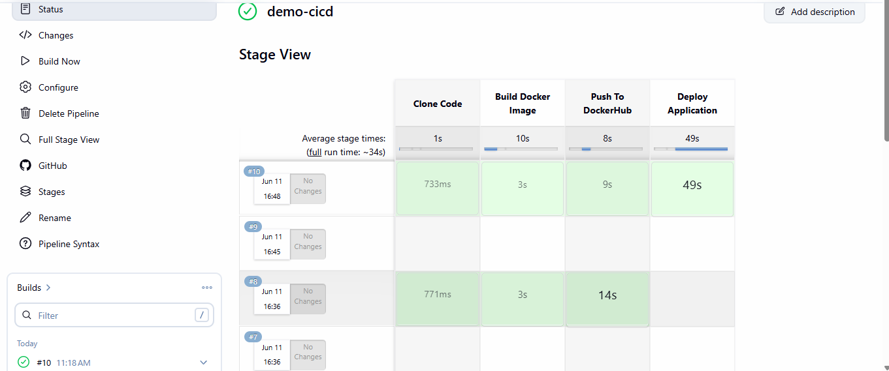

### Containers Running

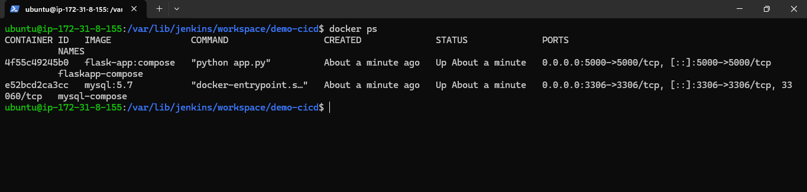

### Application Running

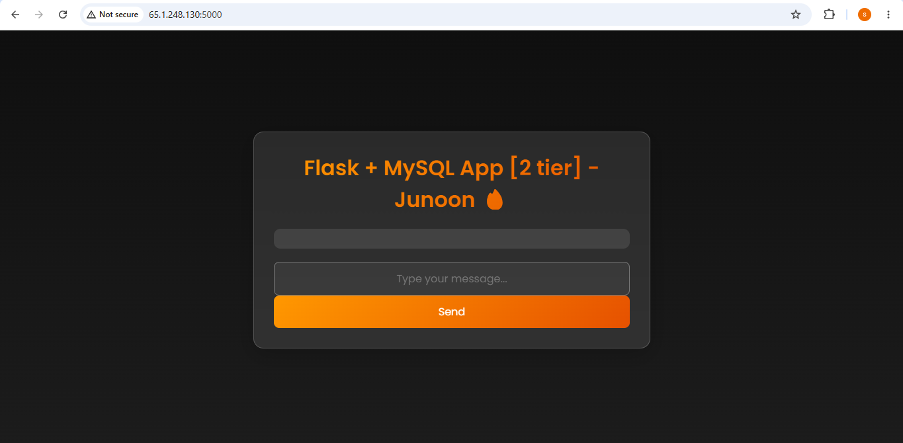

---

## Webhook Automation

### GitHub Webhook Created

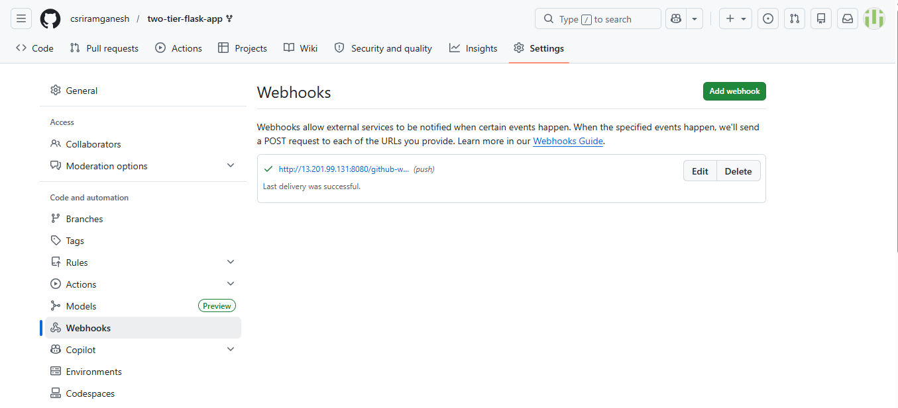

### Webhook Commit Trigger

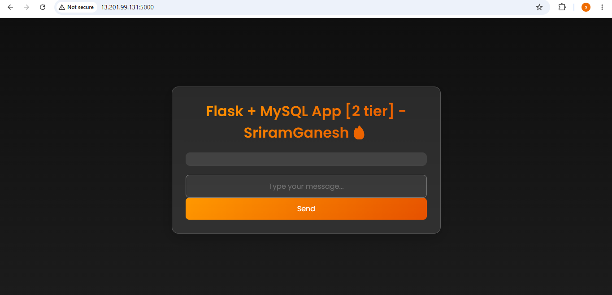

---

# Demo Video

A complete webhook-triggered CI/CD pipeline demonstration is available in:

```text
demo/ci-cd-webhook-demo.mp4
```

---

# Key Learnings

* Jenkins Installation and Configuration
* Jenkins Pipeline Development
* Docker Integration with Jenkins
* Jenkins Credential Management
* DockerHub Image Publishing
* Docker Compose Deployments
* GitHub Webhook Automation
* CI/CD Troubleshooting
* AWS EC2 Administration

---

# Future Enhancements

* Jenkins Distributed Builds using Agents
* Pipeline as Code using Jenkinsfile
* Deployment on Separate Target Server
* SonarQube Integration
* Docker Image Scanning
* Kubernetes Deployment
* GitOps using ArgoCD
* Infrastructure Provisioning with Terraform
